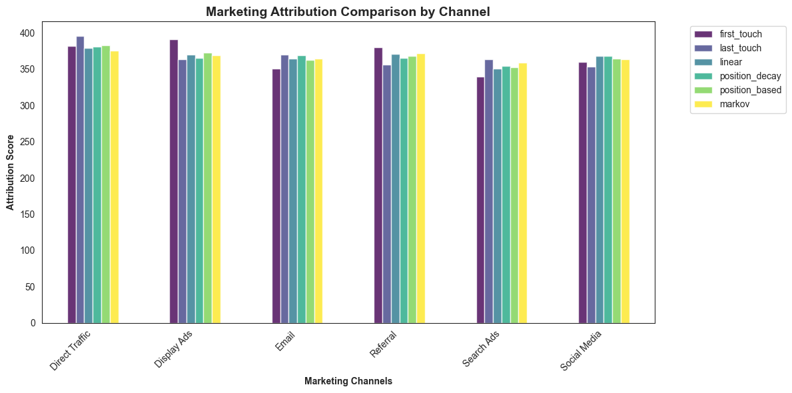

# Attribution Modeling

Attribution modeling is a statistical and analytical approach used to determine how different marketing channels contribute to conversion events. This repository contains code and resources for implementing and analyzing various attribution models, helping assess the impact of campaigns across multiple touchpoints.

# Dataset

This repository contains an attribution analysis based on [Kaggle](https://www.kaggle.com/datasets/vivekparasharr/multi-touch-attribution/data) data. 

The dataset contains 10,000 rows of marketing interaction data, designed to support multi-touch attribution (MTA) analysis. It records user interactions with various marketing channels and campaigns over a two-day period (February 10-11, 2025), along with conversion outcomes.

Columns of the dataset:

| Column name | Description |
| --- | ----------- |
| User ID | A unique identifier for each customer.|
| Timestamp | The exact date and time of the interaction.|
| Channel | The marketing channel where the interaction occurred.|
| Campaign | The specific marketing campaign associated with the interaction. ‘-’ indicates no campaign.|
| Conversion | Indicates whether the user converted (Yes) or not (No). |

The data does not contain any information if the contact was an impression or a click.

Key Insights:  
• Unique Users: 2,847  
• Most Frequent Channel: Direct Traffic (~17.2%)  
• Campaign Involvement: 31.3% of interactions had no campaign assigned.  
• Conversion Rate: 49.44% of interactions resulted in a conversion.  

## Summary

Implementation of common attribution models (Heuristic: First Touch, Last Touch, Linear, Position Decay, Time Decay and algorithmic: Markov) on the data with at least two touchpoints results in the following output:



The bar chart illustrates how conversions are attributed to each channel across different attribution models. Notably, the distribution appears unusually even. This is an uncommon pattern, as channels typically serve different roles and show varying conversion strengths along the customer journey.

## Suggested Resources

- [Marketing Attribution Models](https://pypi.org/project/marketing-attribution-models/)

## Setup

- Install the virtual environment and the required packages by following commands.

### **`macOS`** type the following commands : 

```bash
python -m venv .venv
source .venv/bin/activate 
pip install --upgrade pip
pip install -r requirements.txt
```
### **`WindowsOS`** type the following commands :

   For `PowerShell` CLI :

    ```PowerShell
    pyenv local 3.11.3
    python -m venv .venv
    .venv\Scripts\Activate.ps1
    python -m pip install --upgrade pip
    pip install -r requirements.txt
    ```

    For `Git-bash` CLI :
  
    ```BASH
    pyenv local 3.11.3
    python -m venv .venv
    source .venv/Scripts/activate
    python -m pip install --upgrade pip
    pip install -r requirements.txt
    ```